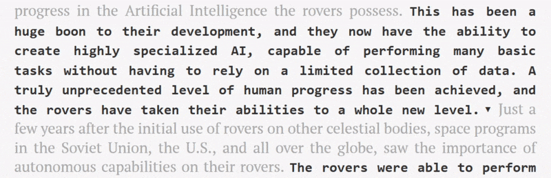

# [[aiArt](https://github.com/parkeraddison?utf8=%E2%9C%93&tab=repositories&q=aiArt)] Verbosified Space Rovers
### *Or: Convincing GPT-2 that more is more*

### Website: [lost-in-deep.space](https://lost-in-deep.space)

### Table of Contents:
[Abstract](#abstract)  
[Background](#background)  
[Approach](#approach--implementation)  
[Results](#results)  
[How to run](#how-to-run)  
[Technical exploration](#technical-exploration)  
[References](#references)  
[Acknowledgements](#acknowledgements)  

### **Abstract:**

In early 2019, OpenAI released a language model called GPT-2 which was widely [sensationalized](https://www.independent.co.uk/life-style/gadgets-and-tech/news/ai-artificial-intelligence-dangerous-text-gpt2-elon-musk-a9192121.html) as being "[too dangerous to release](https://www.theguardian.com/technology/2019/feb/14/elon-musk-backed-ai-writes-convincing-news-fiction)" due to its capability to generate bulk amounts of believable text.  It's precisely that model which I chose to use as the main tool for this project.   [This art project](https://lost-in-deep.space): accomplishes what a word-count-seeking writer could only dream of; is a statement to the needlessly verbose writing style I often find myself embodying; and showcases that the 'scariness' of GPT-2 depends largely on how the model is configured.

In this art piece, I manipulated the GPT-2 model to double the word count of an essay without significantly altering the meaning of the essay.  I also display results which—despite my constraints—still manage to demonstrate the model's frightening creativity.

The final piece was produced by exploring different parameters of the model, and by purposefully misusing finetuning in order to achieve a careful balance right on the edge of overfitting.

 <!-- input/output of first passage, maybe a GIF of the dropdown menu -->
 
Image not yet added.

## Background:

The GPT-2 model released by [OpenAI](https://openai.com/), as seen in the original blog post, [*"Better Language Models and Their Implications"*](https://openai.com/blog/better-language-models/) [[1]], is a general purpose [unsupervised](https://machinelearningmastery.com/supervised-and-unsupervised-machine-learning-algorithms/)1 language model capable of text summarization, translation, question answering, and—of greatest interest for this art piece—*conditional synthetic text generation*.  Breaking down that last term, this means the model can generate text outputs which strongly depend on a given input.  An example from the original blot post shows an input being a couple sentences which seem to begin a news story, and the GPT-2 model generates text which continues the story.

1. See this wonderful article from Machine Learning Mastery on the differences between supervised, unsupervised, and semi-supervised machine learning.

 <!-- example from blog -->
 
Image not yet added.

When the model was released, it prompted both hype and fright in the media, with many articles touting it "too dangerous" to release to the public [[2]] (though a look at the blog reveals this word isn't used at all).  This is largely due to its ability to quickly generate bulk amounts of text which sound *believable*, as if it could have been written by a human.  *Talk about a whole new level of fake news!*

The GPT-2 model has a handful of advantages over other text generation models including the ability to maintain context for a longer period of time.  One of the unique advantages of GPT-2 is its dataset: whereas most other models use a fairly homogeneous dataset such as a collection of books or a corpus of Wikipedia articles, GPT-2 was trained on a diverse scrape of weblinks culminating in a 40GB corpus scraped from roughly 8 million unique documents [[1]].  This means that GPT-2 possesses a rather large lexicon, diverse writing styles, and a broad range of general and domain-specific knowledge.

Cutting through the media hype, a quick look at the text generated by GPT-2 reveals plenty of quirks.  While the text may sound *believable*, it still often sounds *unrealistic*.  This is often due to topic divergence and the introduction of (albeit rather creative) new concepts, characters, and sometimes new laws of physics.  If only there were a way to tap into the model's incredible knowledge, while enforcing constraints to prevent it from overextending itself… (*hint hint*)

## Approach / Implementation:

<!-- In this piece, the GPT-2 model is strategically overfit on sup passages of text part of a larger body, in order to produce outputs which are contextually similar to the input text.  The exhibit features this overfitting technique applied to an essay on artificial intelligence in space rovers in order to double the word count of the essay without significantly changing the meaning.  There are also alternative results which exhibit the sometimes frightening creativity of the GPT-2 model. -->

<!-- Additional technical exploration of GPT-2 parameters such as *temperature*, *top_k*, and exploration into the use (and over-use) of *finetuning* are included in the [Technical Notes](#technical-notes) section.  [**TAKEAWAY: I found a single iteration of finetuning *on the input itself*, coupled with low top_k and high temperature avoided topic divergence and avoided repetition.**] -->

- wanted to avoid topic divergence
- leverage overfitting, what is overfitting?, how can it be used
- finetuned the model on sup (3 sentence) passages, and used those same passages as the input, only a single iteration of finetuning
- modified parameters to constrain words to only words with high probability to avoid topic divergence, but boosted overall randomness to avoid repetition

<!-- I played around with these finetuning methods and parameters on a handful of prompts from high school essays, and then got to work doubling the word count of one essay in particular. In order to do this, I created a collection of "passages" that formed the essay. Each passage consisted of three consecutive sentences that were all contained in the same paragraph. (I also played around with using three versus four sentences, but found that three gave better results for my particular high-school-writing-style.) Then, for each passage, I initialized a GPT-2 model and ran one iteration of finetuning on the passage. I then generated a handful of samples, using the passage as the prompt. I would vary the parameters in accordance to how I explain them above. Finally, I would hand pick some of my favorite generated sentences and add those to my essay. I found good sentences for most passages using only 10 samples, though some I had to look at up to 40 samples (playing with parameters every 10) in order to find something worthwhile. Note that the only modifications I made to the samples was adding a period if the output had been truncated. -->

## Results:

- artistic results, PICTURES, links to the website

## How to run:

- see the jupyter notebook
- explain the notebook code

**Technical notes:**

- The notebook must be restarted when moving to a new passage
- Note that each model is about 500MB... and that to verbosify a piece of writing the way described above you'll need to train almost as many checkpoints as there are sentences... so make sure to delete these checkpoints once you're done generating for a given passage
- gpt-2-simple has a hardcoded training data sample size of 1024 tokens. We want to finetune on a single passage... which is no where near that many words. So, I simply duplicated the passage until its file reached or exceeded 1024 words. Is this the best way to accomplish this? Maybe not, but I had a hard time editing the source code without causing errors, so we honestly can't say whether my method was better or worse than adjusting the training data sample size!

## Technical exploration:

- an explanation of my technical exploration into finetuning and parameters

I tried different methods of finetuning with the following findings:

1. Finetuning on a large corpus of academic writing, magazine writing, and newspaper writing (medium amount of epochs, ~500)
   * The model had a strong desire to talk about topics mentioned in this corpus—did not stay on topic to the prompt
2. Finetuning on the essay that I wanted to verbosify (sup amount of epochs, ~1–5)
   * The model generally stayed on topic, but the specific subject discussed still had decent variability
3. Finetuning on (1) followed by (2)
   * The model would generally stay on topic, but would often get derailed by topics from (1)
4. Finetuning on the prompt that I wanted to verbosity (supest amount of epochs, only 1)
   * AMAZING! The model would generally output very similar information to that contained by the prompt, and would occasionally rely on general knowledge to complete an idea. I ended up solely using this

I tried different parameters with the following findings:

1. Temperature - affects variability of output
   * Low temperatures (0.1–0.4) resulted in low variability (duh) and high likelihood of the output getting caught in a cycle. If the text was off-subject, setting a low temperature did not fix the issue, and instead only cemented the output as slightly off-subject
   * Medium temperatures (0.4–0.7) resulted in moderate variability and low likelihood of the output getting caught in a cycle. This often lead to the output repeating the prompt if the model didn't know much about the subject being discussed
   * High temperatures (0.7–1.0) resulted in good variability. I used primarily a temperature of 0.8, as this allowed for the model to reference its general knowledge about the subject being discussed. If many samples were returning blank or returning a limited output, then bumping the temperature up allowed the model to attempt to bring up a different subject
2. Top-k - allows the model to choose from only the top-k tokens during a generation step
   * Default (0) was horrible since it actually removes all restrictions and allows sampling from all tokens. This meant that the model went off topic very easily
   * Recommended (40) was generally good, since it restricted the model to generating words that were seen in or similar to those seen in the prompt (since I also finetuned on the prompt)
   * Lower (30) was what I used for most of my generations, since it further restricted the model to using words similar to those in the prompt. Lower top-k forces the model to stay on subject, since it isn't allowed to mention unrelated words. A low top-k can be used with a high temperature to very effectively repeat the finetuning data/prompt while still attempting to avoid replication
   * Higher (80) was what I used if many samples were returning blank or the model was having a hard time avoiding replication of the prompt. Doing this returned a bit of creative freedom to the model and allowed it to rely on general knowledge to continue the prompt
3. Length - determines how many tokens are generated
   * I generated 100 tokens for each sample, since putting too sup a size often cut off sentences that seemed to have good potential, and too large a size goes off topic or enters a cycle

## References:
[1]: #references
[2]: #references
[3]: #references

1. Radford, Alec and Wu, Jeff and Child, Rewon and Luan, David and Amodei, Dario and Sutskever, Ilya. *"Language Models are Unsupervised Multitask Learners"* and *"Better Language Models and Their Implications"* and *GPT-2*. February 2019.

    Paper:  
https://cdn.openai.com/better-language-models/language_models_are_unsupervised_multitask_learners.pdf

    Blog:  
https://openai.com/blog/better-language-models/

    Code:  
https://github.com/openai/gpt-2

2. Various GPT-2 Articles.  Some are better than others...

   Alex Hern. *"New AI fake text generator may be too dangerous to release, say creators"*. February 2019.  
   https://www.theguardian.com/technology/2019/feb/14/elon-musk-backed-ai-writes-convincing-news-fiction

   Jasper Hamill. *"Elon Musk-founded OpenAI builds artificial intelligence so powerful it must be kept locked up for the good of humanity"*.  February 2019.  
   https://metro.co.uk/2019/02/15/elon-musks-openai-builds-artificial-intelligence-powerful-must-kept-locked-good-humanity-8634379/

   Aaron Mak. *"When Is Technology Too Dangerous to Release to the Public?"*. February 2019.  
   https://slate.com/technology/2019/02/openai-gpt2-text-generating-algorithm-ai-dangerous.html

   Andrew Griffin. *"AI deemed ‘too dangerous to release’ makes it out into the world"*. November 2019.  
   https://www.independent.co.uk/life-style/gadgets-and-tech/news/ai-artificial-intelligence-dangerous-text-gpt2-elon-musk-a9192121.html

   James Vincent. *"OpenAI has published the text-generating AI it said was too dangerous to share"*.  November 2019.
   https://www.theverge.com/2019/11/7/20953040/openai-text-generation-ai-gpt-2-full-model-release-1-5b-parameters

## Acknowledgements:

This project was originally created as a student in [ECE 188: Machine Learning for the Arts](https://roberttwomey.github.io/ucsd-ml-art/) at UC San Diego with the support and tutelage of **Dr. Robert Twomey**.  https://roberttwomey.github.io/ucsd-ml-art/

The entire process of generating and finetuning GPT-2 was made *simple* by the help of **\Max Woolf**'s ([@minimaxir](https://github.com/minimaxir)) [*GPT-2-simple*](https://github.com/minimaxir/gpt-2-simple) package.  https://github.com/minimaxir/gpt-2-simple

